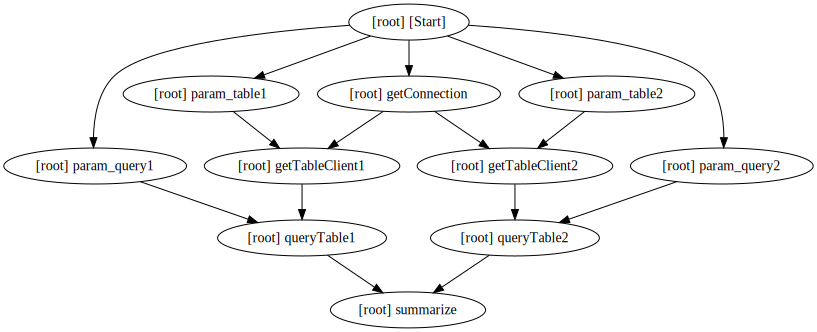

# AsyncJob

AsyncJob aiming to help you organize code in dependencyGraph(DAG), instead of a sequential chain.

# Concepts
**Job** is a graph describe code blocks and their connections.
- all tasks added to a job will be blocked from running, until Start() is triggered
- job can be visualized for human to understand

**Step** is a individual code block which can be executed and have inputs, output.
- a step would be started once all it's dependency is finished.
- output of a step can be feed into next step as input, type is checked by go generics.

# Usage

### Build and run a asyncjob
```golang
	job := NewJob("sqlSummaryJob")
	jobLib := &SqlSummaryJobLib{}

	# connection
	connTask, _ := AddStep(bCtx, job, "getConnection", jobLib.GetConnection, []string{})

	# query1
	table1ParamTask := InputParam(job, "param_table1", "table1")
	table1ClientTask, _ := StepAfterBoth(bCtx, job, "getTableClient1", connTask, table1ParamTask, jobLib.GetTableClient)
	query1ParamTask := InputParam(job, "param_query1", "select x,y,z from table1")
	qery1ResultTask, _ := StepAfterBoth(bCtx, job, "queryTable1", table1ClientTask, query1ParamTask, jobLib.ExecuteQuery)

	# query2
	table2ParamTask := InputParam(job, "param_table2", "table2")
	table2ClientTask, _ := StepAfterBoth(bCtx, job, "getTableClient2", connTask, table2ParamTask, jobLib.GetTableClient)
	query2ParamTask := InputParam(job, "param_query2", &sjb.Query2)
	qery2ResultTask, _ := StepAfterBoth(bCtx, job, "queryTable2", table2ClientTask, query2ParamTask, jobLib.ExecuteQuery)

	# summarize
	StepAfterBoth(bCtx, job, "summarize", qery1ResultTask, qery2ResultTask, jobLib.SummarizeQueryResult)

	# visualize the job
	dotGraph := job.Visualize()
	fmt.Println(dotGraph)

	# execute job
	job.Start(context.Background())
	job.Wait(context.WithTimeout(context.Background(), 10*time.Second))
```

### visualize of a job
this visualize depend on github.com/hashicorp/terraform/dag, with some limitation, may need some upstream contribution.
```
digraph {
	compound = "true"
	newrank = "true"
	subgraph "root" {
		"[root] [Start]" -> "[root] getConnection"
		"[root] [Start]" -> "[root] param_query1"
		"[root] [Start]" -> "[root] param_query2"
		"[root] [Start]" -> "[root] param_table1"
		"[root] [Start]" -> "[root] param_table2"
		"[root] getConnection" -> "[root] getTableClient1"
		"[root] getConnection" -> "[root] getTableClient2"
		"[root] getTableClient1" -> "[root] queryTable1"
		"[root] getTableClient2" -> "[root] queryTable2"
		"[root] param_query1" -> "[root] queryTable1"
		"[root] param_query2" -> "[root] queryTable2"
		"[root] param_table1" -> "[root] getTableClient1"
		"[root] param_table2" -> "[root] getTableClient2"
		"[root] queryTable1" -> "[root] summarize"
		"[root] queryTable2" -> "[root] summarize"
	}
}
```

