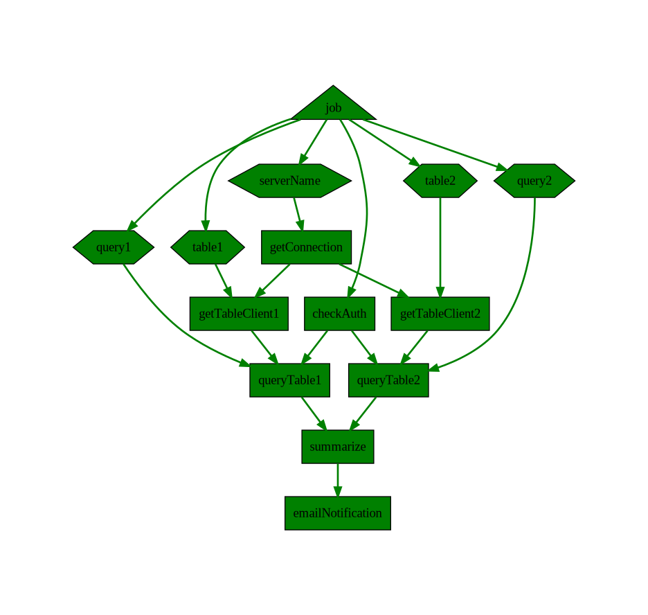

# AsyncJob

AsyncJob aiming to help you organize code in dependencyGraph(DAG), instead of a sequential chain.

# Concepts
**Job** is a graph describe code blocks and their connections.
- all tasks added to a job will be blocked from running, until Start() is triggered
- job can be visualized for human to understand

**Step** is a individual code block which can be executed and have inputs, output.
- a step would be started once all it's dependency is finished.
- output of a step can be feed into next step as input, type is checked by go generics.
- step is wrapped in [AsyncTask](https://github.com/Azure/go-asynctask) with strongType info preserved
- you can feed parameters as a step as well.

# asyncjob v2

It is recommanded to use asyncJob v2, it separate job definition and job execution.

with v1 you create the job and run the job, you would have to rebuild the job again to run it again.

with v2, you can create the jobDefiniton, and start it multiple times, that will create multiple job instance.

another key different is on v2, the function provided shouldn't have a receiever object, as that would introduce shared state between multiple instances.

# Usage

### Build and run a asyncjob
```golang
	job := NewJob("sqlSummaryJob")
	jobLib := &SqlSummaryJobLib{}

	# connection
	connTask, _ := AddStep(bCtx, job, "getConnection", jobLib.GetConnection, []string{})

	# query1
	table1ParamTask := InputParam(job, "param_table1", "table1")
	table1ClientTask, _ := StepAfterBoth(bCtx, job, "getTableClient1", connTask, table1ParamTask, jobLib.GetTableClient)
	query1ParamTask := InputParam(job, "param_query1", "select x,y,z from table1")
	qery1ResultTask, _ := StepAfterBoth(bCtx, job, "queryTable1", table1ClientTask, query1ParamTask, jobLib.ExecuteQuery)

	# query2
	table2ParamTask := InputParam(job, "param_table2", "table2")
	table2ClientTask, _ := StepAfterBoth(bCtx, job, "getTableClient2", connTask, table2ParamTask, jobLib.GetTableClient)
	query2ParamTask := InputParam(job, "param_query2", &sjb.Query2)
	qery2ResultTask, _ := StepAfterBoth(bCtx, job, "queryTable2", table2ClientTask, query2ParamTask, jobLib.ExecuteQuery)

	# summarize
	StepAfterBoth(bCtx, job, "summarize", qery1ResultTask, qery2ResultTask, jobLib.SummarizeQueryResult)

	# execute job
	job.Start(context.Background())
	job.Wait(context.WithTimeout(context.Background(), 10*time.Second))
```

### visualize of a job
```
	# visualize the job
	dotGraph := job.Visualize()
	fmt.Println(dotGraph)
```



```
digraph {
	newrank = "true"
		param_table1 [label="table1" shape=hexagon style=filled tooltip="Type: param\nName: table1\nState: completed\nStartAt: 2022-11-03T00:56:30.006196-07:00\nDuration: 12.657µs" fillcolor=green] 
		param_query1 [label="query1" shape=hexagon style=filled tooltip="Type: param\nName: query1\nState: completed\nStartAt: 2022-11-03T00:56:30.0062-07:00\nDuration: 17.013µs" fillcolor=green] 
		root_job [label="job" shape=triangle style=filled tooltip="Type: root\nName: job\nState: completed\nStartAt: 2022-11-03T00:56:30.006183-07:00\nDuration: 3.695µs" fillcolor=green] 
		param_query2 [label="query2" shape=hexagon style=filled tooltip="Type: param\nName: query2\nState: completed\nStartAt: 2022-11-03T00:56:30.006197-07:00\nDuration: 13.781µs" fillcolor=green] 
		task_getTableClient1 [label="getTableClient1" shape=box style=filled tooltip="Type: task\nName: getTableClient1\nState: completed\nStartAt: 2022-11-03T00:56:30.006304-07:00\nDuration: 34.652µs" fillcolor=green] 
		task_queryTable1 [label="queryTable1" shape=box style=filled tooltip="Type: task\nName: queryTable1\nState: completed\nStartAt: 2022-11-03T00:56:30.006349-07:00\nDuration: 3.217443247s" fillcolor=green] 
		param_table2 [label="table2" shape=hexagon style=filled tooltip="Type: param\nName: table2\nState: completed\nStartAt: 2022-11-03T00:56:30.006199-07:00\nDuration: 15.632µs" fillcolor=green] 
		task_getTableClient2 [label="getTableClient2" shape=box style=filled tooltip="Type: task\nName: getTableClient2\nState: completed\nStartAt: 2022-11-03T00:56:30.00631-07:00\nDuration: 51.872µs" fillcolor=green] 
		task_queryTable2 [label="queryTable2" shape=box style=filled tooltip="Type: task\nName: queryTable2\nState: completed\nStartAt: 2022-11-03T00:56:30.006377-07:00\nDuration: 67.814µs" fillcolor=green] 
		task_emailNotification [label="emailNotification" shape=box style=filled tooltip="Type: task\nName: emailNotification\nState: completed\nStartAt: 2022-11-03T00:56:33.223952-07:00\nDuration: 3.92µs" fillcolor=green] 
		param_serverName [label="serverName" shape=hexagon style=filled tooltip="Type: param\nName: serverName\nState: completed\nStartAt: 2022-11-03T00:56:30.006198-07:00\nDuration: 14.638µs" fillcolor=green] 
		task_getConnection [label="getConnection" shape=box style=filled tooltip="Type: task\nName: getConnection\nState: completed\nStartAt: 2022-11-03T00:56:30.006231-07:00\nDuration: 62.234µs" fillcolor=green] 
		task_checkAuth [label="checkAuth" shape=box style=filled tooltip="Type: task\nName: checkAuth\nState: completed\nStartAt: 2022-11-03T00:56:30.006212-07:00\nDuration: 650ns" fillcolor=green] 
		task_summarize [label="summarize" shape=box style=filled tooltip="Type: task\nName: summarize\nState: completed\nStartAt: 2022-11-03T00:56:33.22392-07:00\nDuration: 4.325µs" fillcolor=green] 
        
		param_table1 -> task_getTableClient1 [style=bold tooltip="Time: 2022-11-03T00:56:30.006304-07:00" color=green] 
		param_query1 -> task_queryTable1 [style=bold tooltip="Time: 2022-11-03T00:56:30.006349-07:00" color=green] 
		param_table2 -> task_getTableClient2 [style=bold tooltip="Time: 2022-11-03T00:56:30.00631-07:00" color=green] 
		task_getTableClient2 -> task_queryTable2 [style=bold tooltip="Time: 2022-11-03T00:56:30.006377-07:00" color=green] 
		param_query2 -> task_queryTable2 [style=bold tooltip="Time: 2022-11-03T00:56:30.006377-07:00" color=green] 
		task_queryTable2 -> task_summarize [style=bold tooltip="Time: 2022-11-03T00:56:33.22392-07:00" color=green] 
		root_job -> param_serverName [style=bold tooltip="Time: 2022-11-03T00:56:30.006198-07:00" color=green] 
		root_job -> task_checkAuth [style=bold tooltip="Time: 2022-11-03T00:56:30.006212-07:00" color=green] 
		root_job -> param_table1 [style=bold tooltip="Time: 2022-11-03T00:56:30.006196-07:00" color=green] 
		root_job -> param_query1 [style=bold tooltip="Time: 2022-11-03T00:56:30.0062-07:00" color=green] 
		root_job -> param_table2 [style=bold tooltip="Time: 2022-11-03T00:56:30.006199-07:00" color=green] 
		root_job -> param_query2 [style=bold tooltip="Time: 2022-11-03T00:56:30.006197-07:00" color=green] 
		param_serverName -> task_getConnection [style=bold tooltip="Time: 2022-11-03T00:56:30.006231-07:00" color=green] 
		task_getTableClient1 -> task_queryTable1 [style=bold tooltip="Time: 2022-11-03T00:56:30.006349-07:00" color=green] 
		task_queryTable1 -> task_summarize [style=bold tooltip="Time: 2022-11-03T00:56:33.22392-07:00" color=green] 
		task_summarize -> task_emailNotification [style=bold tooltip="Time: 2022-11-03T00:56:33.223952-07:00" color=green] 
		task_getConnection -> task_getTableClient1 [style=bold tooltip="Time: 2022-11-03T00:56:30.006304-07:00" color=green] 
		task_getConnection -> task_getTableClient2 [style=bold tooltip="Time: 2022-11-03T00:56:30.00631-07:00" color=green] 
		task_checkAuth -> task_queryTable1 [style=bold tooltip="Time: 2022-11-03T00:56:30.006349-07:00" color=green] 
		task_checkAuth -> task_queryTable2 [style=bold tooltip="Time: 2022-11-03T00:56:30.006377-07:00" color=green] 

}
```

