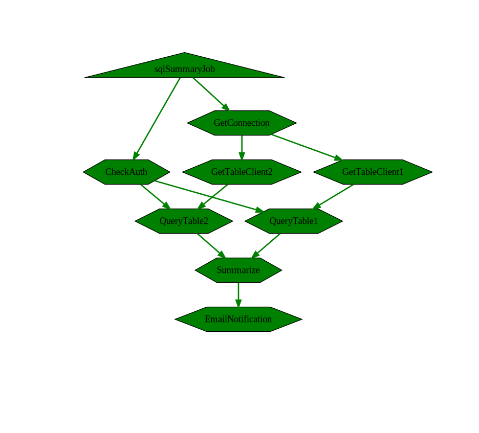

# AsyncJob

AsyncJob aiming to help you organize code in dependencyGraph(DAG), instead of a sequential chain.

# Concepts
**JobDefinition** is a graph describe code blocks and their connections.
- you can use AddStep, StepAfter, StepAfterBoth to organize steps in a JobDefinition.
- jobDefinition can be and should be build and seal in package init time.
- jobDefinition have a generic typed input
- calling Start with the input, will instantiate an jobInstance, and steps will began to execute.
- jobDefinition can be visualized using graphviz, easier for human to understand.

**JobInstance** is an instance of JobDefinition, after calling .Start() method from JobDefinition
- all Steps on the definition will be copied to JobInstance.
- each step will be executed once it's precedent step is done.
- jobInstance can be visualized as well, instance visualize contains detailed info(startTime, duration) on each step.

**StepDefinition** is a individual code block which can be executed and have inputs, output.
- StepDefinition describe it's preceding steps.
- StepDefinition contains generic Params
- ideally all stepMethod should come from JobInput (generic type on JobDefinition), or static method. To avoid shared state between jobs.
- output of a step can be feed into next step as input, type is checked by go generics.

**StepInstance** is instance of StepDefinition
- step is wrapped in [AsyncTask](https://github.com/Azure/go-asynctask)
- a step would be started once all it's dependency is finished.
- executionPolicy can be applied {Retry, ContextEnrichment}

# Usage

### Build and run a asyncjob
```golang

// SqlSummaryAsyncJobDefinition is the job definition for the SqlSummaryJobLib
//   JobDefinition fit perfectly in init() function
var SqlSummaryAsyncJobDefinition *asyncjob.JobDefinitionWithResult[SqlSummaryJobLib, SummarizedResult]

func init() {
	var err error
	SqlSummaryAsyncJobDefinition, err = BuildJobWithResult(map[string]asyncjob.RetryPolicy{})
	if err != nil {
		panic(err)
	}

	SqlSummaryAsyncJobDefinition.Seal()
}

func BuildJob(retryPolicies map[string]asyncjob.RetryPolicy) (*asyncjob.JobDefinition[SqlSummaryJobLib], error) {
	job := asyncjob.NewJobDefinition[SqlSummaryJobLib]("sqlSummaryJob")

	connTsk, err := asyncjob.AddStep(job, "GetConnection", connectionStepFunc, asyncjob.WithRetry(retryPolicies["GetConnection"]), asyncjob.WithContextEnrichment(EnrichContext))
	if err != nil {
		return nil, fmt.Errorf("error adding step GetConnection: %w", err)
	}

	checkAuthTask, err := asyncjob.AddStep(job, "CheckAuth", checkAuthStepFunc, asyncjob.WithContextEnrichment(EnrichContext))
	if err != nil {
		return nil, fmt.Errorf("error adding step CheckAuth: %w", err)
	}

	table1ClientTsk, err := asyncjob.StepAfter(job, "GetTableClient1", connTsk, tableClient1StepFunc, asyncjob.WithContextEnrichment(EnrichContext))
	if err != nil {
		return nil, fmt.Errorf("error adding step GetTableClient1: %w", err)
	}

	qery1ResultTsk, err := asyncjob.StepAfter(job, "QueryTable1", table1ClientTsk, queryTable1StepFunc, asyncjob.WithRetry(retryPolicies["QueryTable1"]), asyncjob.ExecuteAfter(checkAuthTask), asyncjob.WithContextEnrichment(EnrichContext))
	if err != nil {
		return nil, fmt.Errorf("error adding step QueryTable1: %w", err)
	}

	table2ClientTsk, err := asyncjob.StepAfter(job, "GetTableClient2", connTsk, tableClient2StepFunc, asyncjob.WithContextEnrichment(EnrichContext))
	if err != nil {
		return nil, fmt.Errorf("error adding step GetTableClient2: %w", err)
	}

	qery2ResultTsk, err := asyncjob.StepAfter(job, "QueryTable2", table2ClientTsk, queryTable2StepFunc, asyncjob.WithRetry(retryPolicies["QueryTable2"]), asyncjob.ExecuteAfter(checkAuthTask), asyncjob.WithContextEnrichment(EnrichContext))
	if err != nil {
		return nil, fmt.Errorf("error adding step QueryTable2: %w", err)
	}

	summaryTsk, err := asyncjob.StepAfterBoth(job, "Summarize", qery1ResultTsk, qery2ResultTsk, summarizeQueryResultStepFunc, asyncjob.WithRetry(retryPolicies["Summarize"]), asyncjob.WithContextEnrichment(EnrichContext))
	if err != nil {
		return nil, fmt.Errorf("error adding step Summarize: %w", err)
	}

	_, err = asyncjob.AddStep(job, "EmailNotification", emailNotificationStepFunc, asyncjob.ExecuteAfter(summaryTsk), asyncjob.WithContextEnrichment(EnrichContext))
	if err != nil {
		return nil, fmt.Errorf("error adding step EmailNotification: %w", err)
	}
	return job, nil
}
	// execute job
	jobInstance1 := SqlSummaryAsyncJobDefinition.Start(ctx, &SqlSummaryJobLib{...})
	jobInstance2 := SqlSummaryAsyncJobDefinition.Start(ctx, &SqlSummaryJobLib{...})

    // ...

	jobInstance1.Wait(context.WithTimeout(context.Background(), 10*time.Second))
	jobInstance2.Wait(context.WithTimeout(context.Background(), 10*time.Second))
```

### visualize of a job
```
	# visualize the job
	dotGraph := job.Visualize()
	fmt.Println(dotGraph)
```



```
digraph {
	newrank = "true"
		"QueryTable2" [label="QueryTable2" shape=hexagon style=filled tooltip="State: completed\nStartAt: 2022-12-12T12:00:32.254054-08:00\nDuration: 13.207µs" fillcolor=green] 
		"QueryTable1" [label="QueryTable1" shape=hexagon style=filled tooltip="State: completed\nStartAt: 2022-12-12T12:00:32.254098-08:00\nDuration: 11.394µs" fillcolor=green] 
		"EmailNotification" [label="EmailNotification" shape=hexagon style=filled tooltip="State: completed\nStartAt: 2022-12-12T12:00:32.254143-08:00\nDuration: 11.757µs" fillcolor=green] 
		"sqlSummaryJob" [label="sqlSummaryJob" shape=triangle style=filled tooltip="State: completed\nStartAt: 0001-01-01T00:00:00Z\nDuration: 0s" fillcolor=green] 
		"GetConnection" [label="GetConnection" shape=hexagon style=filled tooltip="State: completed\nStartAt: 2022-12-12T12:00:32.253844-08:00\nDuration: 154.825µs" fillcolor=green] 
		"GetTableClient2" [label="GetTableClient2" shape=hexagon style=filled tooltip="State: completed\nStartAt: 2022-12-12T12:00:32.254017-08:00\nDuration: 25.793µs" fillcolor=green] 
		"GetTableClient1" [label="GetTableClient1" shape=hexagon style=filled tooltip="State: completed\nStartAt: 2022-12-12T12:00:32.254076-08:00\nDuration: 12.459µs" fillcolor=green] 
		"Summarize" [label="Summarize" shape=hexagon style=filled tooltip="State: completed\nStartAt: 2022-12-12T12:00:32.254121-08:00\nDuration: 7.88µs" fillcolor=green] 
		"CheckAuth" [label="CheckAuth" shape=hexagon style=filled tooltip="State: completed\nStartAt: 2022-12-12T12:00:32.253818-08:00\nDuration: 18.52µs" fillcolor=green] 

		"CheckAuth" -> "QueryTable2" [style=bold tooltip="Time: 2022-12-12T12:00:32.254054-08:00" color=green] 
		"CheckAuth" -> "QueryTable1" [style=bold tooltip="Time: 2022-12-12T12:00:32.254098-08:00" color=green] 
		"GetTableClient2" -> "QueryTable2" [style=bold tooltip="Time: 2022-12-12T12:00:32.254054-08:00" color=green] 
		"GetTableClient1" -> "QueryTable1" [style=bold tooltip="Time: 2022-12-12T12:00:32.254098-08:00" color=green] 
		"QueryTable1" -> "Summarize" [style=bold tooltip="Time: 2022-12-12T12:00:32.254121-08:00" color=green] 
		"QueryTable2" -> "Summarize" [style=bold tooltip="Time: 2022-12-12T12:00:32.254121-08:00" color=green] 
		"Summarize" -> "EmailNotification" [style=bold tooltip="Time: 2022-12-12T12:00:32.254143-08:00" color=green] 
		"sqlSummaryJob" -> "CheckAuth" [style=bold tooltip="Time: 2022-12-12T12:00:32.253818-08:00" color=green] 
		"sqlSummaryJob" -> "GetConnection" [style=bold tooltip="Time: 2022-12-12T12:00:32.253844-08:00" color=green] 
		"GetConnection" -> "GetTableClient2" [style=bold tooltip="Time: 2022-12-12T12:00:32.254017-08:00" color=green] 
		"GetConnection" -> "GetTableClient1" [style=bold tooltip="Time: 2022-12-12T12:00:32.254076-08:00" color=green] 
}
```

### collect result from job
you can enrich job to aware result from given step, then you can collect result (strongly typed) from that step

```
var SqlSummaryAsyncJobDefinition *asyncjob.JobDefinitionWithResult[SqlSummaryJobLib, SummarizedResult]
SqlSummaryAsyncJobDefinition = asyncjob.JobWithResult(job /*from previous section*/, summaryTsk)

jobInstance1 := SqlSummaryAsyncJobDefinition.Start(ctx, &SqlSummaryJobLib{...})
result, err := jobInstance1.Result(ctx)
```